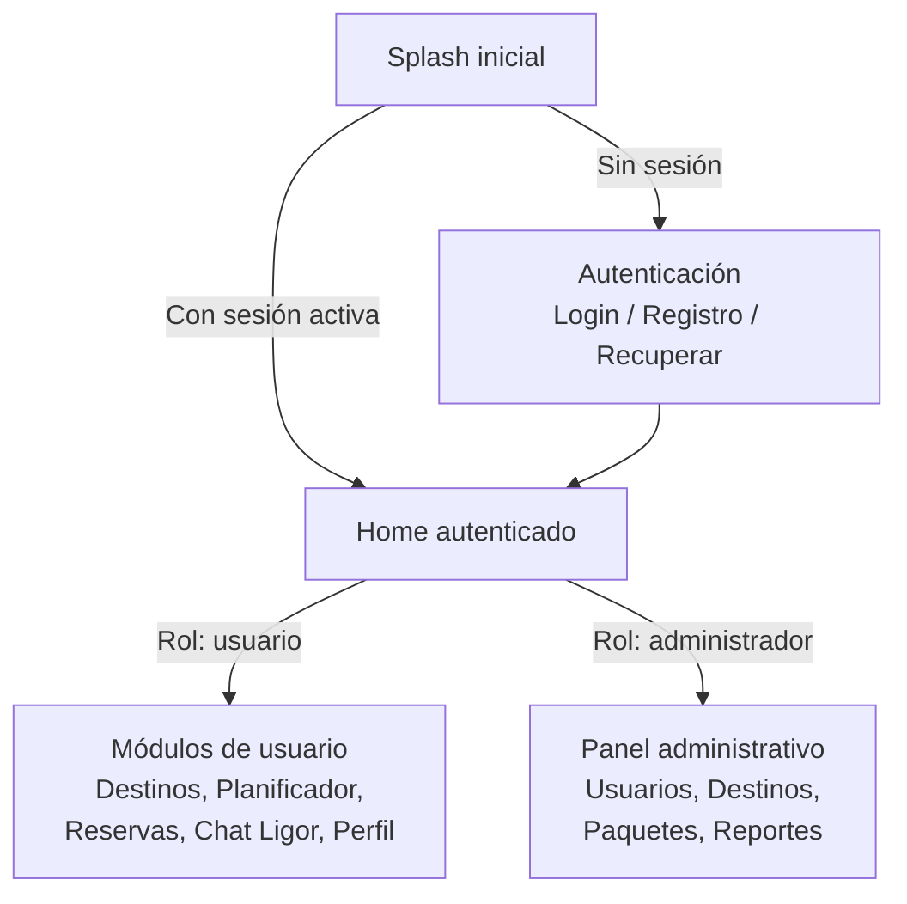

#Diagrama de flujo de la APP LIGOR TRAVEL

```mermaid
flowchart TD
    A["Splash inicial"]

    A -->|"Sin sesión"| B["Autenticación<br/>Login / Registro / Recuperar"]
    A -->|"Con sesión activa"| C["Home autenticado"]

    B --> C

    C -->|"Rol: usuario"| D["Módulos de usuario<br/>Destinos, Planificador,<br/>Reservas, Chat Ligor, Perfil"]

    C -->|"Rol: administrador"| E["Panel administrativo<br/>Usuarios, Destinos,<br/>Paquetes, Reportes"]
```
